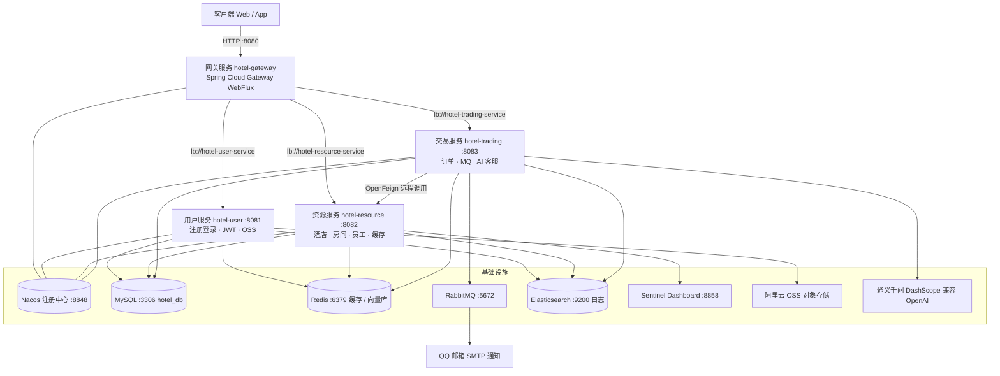
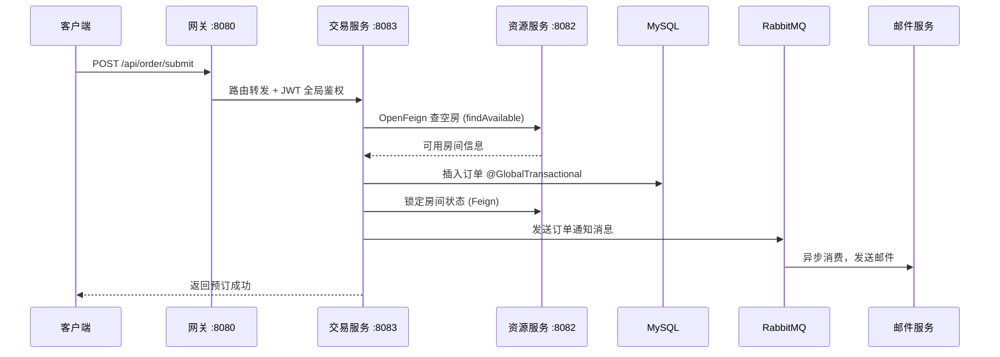
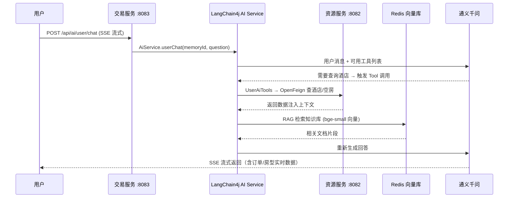

# CloudHotel 酒店管理系统（微服务版）

基于 **Spring Cloud Alibaba** 微服务架构的酒店管理系统，实现从用户注册登录、酒店/房间浏览、在线预订、订单管理到 **AI 智能客服 + RAG 知识库问答** 的完整业务闭环。

> 仓库：https://github.com/Chillwinner/CloudHotel

## 目录

- [系统架构](#系统架构)
- [核心功能](#核心功能)
- [技术栈](#技术栈)
- [模块说明](#模块说明)
- [简历八股文重点](#简历八股文重点)
- [快速开始](#快速开始)
- [常见问题](#常见问题)

## 系统架构



### 核心业务链路：下单预订（分布式事务 + 异步通知）



### AI 客服链路：Function Calling + RAG + 流式输出



## 核心功能

| 模块 | 功能 |
|------|------|
| **用户服务** | 注册、登录、JWT 签发、用户管理（封禁/解封）、阿里云 OSS 头像上传、Redis 缓存 |
| **资源服务** | 酒店 / 房间 / 员工管理、空房查询、房间状态锁定与释放、Redis 缓存 + Redisson 锁 |
| **交易服务** | 下单（Seata 分布式事务）、订单查询与统计、RabbitMQ 异步邮件通知、AI 智能客服（工具调用 + RAG + 流式） |
| **网关服务** | 统一入口、动态路由（lb://）、JWT 全局过滤器鉴权、跨域配置、Swagger 聚合 |

## 技术栈

### 核心框架

| 组件 | 版本 | 用途 |
|------|------|------|
| Java | 21 (LTS) | 开发语言 |
| Spring Boot | 3.5.0 | 基础框架 |
| Spring Cloud | 2025.0.0 | 微服务治理 |
| Spring Cloud Alibaba | 2025.0.0.0 | 阿里巴巴微服务组件 |
| Maven | 3.8+ | 多模块构建（父 POM 统一版本管理） |

### 微服务组件

| 组件 | 用途 | 简历关键词 |
|------|------|-----------|
| **Nacos** | 服务注册与发现 | AP/CP 模式切换、心跳机制、临时/持久实例、健康检查 |
| **Gateway (WebFlux)** | API 网关 | 路由谓词、GlobalFilter 过滤器链、JWT 鉴权、lb:// 负载均衡、跨域 CORS、Swagger 聚合 |
| **Sentinel 1.8.6** | 流量控制 / 熔断降级 | 滑动窗口、Dashboard 监控（8858）、客户端接入 |
| **OpenFeign** | 声明式远程调用 | 接口定义远程 API、与 LoadBalancer 集成、服务降级 |
| **LoadBalancer** | 客户端负载均衡 | 替代 Ribbon，轮询策略、实例选择 |
| **Seata** | 分布式事务 | `@GlobalTransactional`、AT 模式、undo_log、全局锁 |

### 数据层与中间件

| 组件 | 版本 | 用途 / 简历关键词 |
|------|------|-------------------|
| MySQL | 8.x | 业务数据库（JDBC + MyBatis） |
| MyBatis | 3.0.4 | 半自动 ORM、XML 动态 SQL、驼峰映射 |
| Redis | 6.0+ | 缓存（逻辑过期 + 空值占位 + 随机过期）、AI 对话记忆、向量检索存储 |
| Redisson | 3.40.2 | 分布式锁（读写锁 / 看门狗 / 可重入），解决缓存击穿 |
| RabbitMQ | 3.10+ | 下单异步解耦、`@RabbitListener` 消费、削峰填谷 |
| Elasticsearch | 7.x | AOP 切面采集接口异常日志，批量 `_bulk` 写入 |
| 阿里云 OSS | 3.15.1 | 对象存储（头像/图片上传） |

### AI 与大模型（亮点）

| 组件 | 版本 | 用途 |
|------|------|------|
| LangChain4j | 1.0.0-beta3 | Java 版 LLM 应用框架 |
| 通义千问 (DashScope) | qwen-turbo | 对话模型（OpenAI 兼容模式） |
| Function Calling | — | 自定义 Tool：查酒店/查空房/下单/查订单，模型自动决策调用 |
| RAG 检索增强 | — | BGE-small 本地嵌入模型 + Redis 向量库 + text-embedding-v3，检索酒店知识库 |
| 流式输出 | — | Reactor Flux + SSE (StreamingResponseBody) 逐 token 返回 |
| 对话记忆 | — | Redis 持久化 ChatMemoryStore，24h TTL |

### 其他技术

- **JWT** (jjwt 0.9.1) - 无状态认证，网关全局过滤器校验 + ThreadLocal 用户上下文
- **MD5** (spring-security-crypto) - 密码加密
- **AOP** - 接口日志切面、异步批量写 ES
- **springdoc-openapi 2.3.0** - Swagger UI 接口文档
- **Lombok** - 简化代码
- **Reactor / WebFlux** - 响应式流式输出

## 模块说明

| 服务 | 端口 | 说明 |
|------|------|------|
| hotel_gateway | 8080 | 网关：路由 / JWT 鉴权 / CORS / Swagger 聚合 |
| hotel_user | 8081 | 用户：注册登录、JWT、OSS 上传、缓存 |
| hotel-resource | 8082 | 资源：酒店 / 房间 / 员工 / 空房查询 |
| hotel-trading | 8083 | 交易：订单、Seata、RabbitMQ、AI 客服 |
| Nacos | 8848 | 注册中心 |
| Sentinel Dashboard | 8858 | 流控监控 |

> 根目录 `src/` 为早期单体版本（`com.aura.hotel`），微服务版为 `hotel_*` 四个模块。

## 简历八股文重点

### 1. 微服务架构

- **服务拆分**：按业务域拆分为用户 / 资源 / 交易 / 网关四服务，单一职责、高内聚低耦合
- **服务注册发现**：Nacos，临时实例心跳续约、服务端摘除，AP（可用性优先）/ CP 模式差异
- **服务间通信**：OpenFeign 声明式调用 vs RestTemplate，LoadBalancer 负载均衡
- **网关统一入口**：Spring Cloud Gateway（WebFlux 非阻塞）、路由谓词 Path 匹配、GlobalFilter 实现 JWT 鉴权、限流可扩展
- **服务容错**：Sentinel 限流 / 熔断 / 降级，与 Hystrix 对比，滑动窗口算法

### 2. 分布式事务（Seata）

- **AT 模式原理**：两阶段提交，自动生成 undo_log 回滚日志、全局锁防止脏写
- **`@GlobalTransactional`**：事务发起方注解，RM 分支注册、TC 全局协调
- **CAP / BASE**：分布式系统一致性权衡，为什么不能用本地事务
- **最终一致性方案对比**：Seata AT vs 本地消息表 vs MQ 事务消息

### 3. Redis 缓存（三兄弟实战）

- **缓存穿透**：查询不存在数据 → 空值 "NULL" 占位缓存
- **缓存击穿**：热点 key 过期瞬间大量请求 → Redisson 读写锁互斥 + **逻辑过期异步刷新**（缓存不设 TTL，逻辑过期后加锁回源刷新）
- **缓存雪崩**：批量 key 同时失效 → 逻辑过期时间 + **随机 1~30 分钟偏移**
- **缓存一致性**：先更新数据库再删缓存、延迟双删
- **Redisson 分布式锁**：看门狗自动续期、可重入、读写锁

### 4. 消息队列（RabbitMQ）

- **异步解耦**：下单成功 → 发消息 → 邮件服务异步消费，主链路不阻塞
- **交换机类型**：Direct / Fanout / Topic / Headers
- **消息可靠性**：生产者 confirm、消费者手动 ack、持久化、死信队列
- **幂等性**：消息重复消费处理（去重表 / Redis SETNX）

### 5. 安全认证（JWT）

- **无状态认证**：Header.Payload.Signature 三段式，网关统一校验，服务间无 Session
- **Token 过期与刷新**：双 Token 机制
- **ThreadLocal 传递用户上下文**：网关解析 → 服务间传递 → 业务取用
- **密码加密**：MD5（可扩展加盐 / BCrypt）

### 6. AI Agent（新亮点，强烈建议写）

- **Function Calling**：LLM 自主决策调用业务 Tool（查酒店、查空房、下单），工具参数 Schema 定义
- **RAG 检索增强**：文档切分 → BGE 嵌入向量化 → Redis 向量检索 TopK → 注入上下文，解决 LLM 幻觉
- **流式输出**：SSE 逐 token 返回，提升用户体验
- **对话记忆**：Redis 持久化多轮记忆，按用户隔离

### 7. AOP 与日志

- **AOP 切面**：环绕通知采集接口耗时 / 参数 / 状态
- **异步批量写入 ES**：内存有界队列（500）缓冲 + 定时批量 `_bulk`，失败回队重试，避免阻塞业务线程

## 快速开始

### 环境要求

| 组件 | 版本 | 说明 |
|------|------|------|
| JDK | 21+ | Java 21 LTS |
| Maven | 3.8+ | 构建工具 |
| MySQL | 8.0+ | 数据库 |
| Redis | 6.0+ | 缓存 + 向量库 |
| Nacos | 2.2+ | 注册中心 |
| RabbitMQ | 3.10+ | 交易服务邮件通知（可选） |
| Elasticsearch | 7.x | 日志（可选） |

### 1. 克隆项目

```bash
git clone https://github.com/Chillwinner/CloudHotel.git
cd CloudHotel
```

### 2. 配置环境

复制各服务的 `.example` 配置并填写实际值（**含密钥的 `application.yml` 已被 .gitignore 忽略，勿提交**）：

```bash
cp hotel_user/src/main/resources/application.yml.example      hotel_user/src/main/resources/application.yml
cp hotel-resource/src/main/resources/application.yml.example hotel-resource/src/main/resources/application.yml
cp hotel-trading/src/main/resources/application.yml.example  hotel-trading/src/main/resources/application.yml
cp hotel_gateway/src/main/resources/application.yml.example  hotel_gateway/src/main/resources/application.yml
```

需要修改的配置项：

| 配置项 | 说明 |
|--------|------|
| `spring.datasource.password` | MySQL 密码 |
| `spring.data.redis.password` | Redis 密码 |
| `jwt.secret-key` | JWT 密钥（四个服务需一致） |
| `sky.alioss.access-key-id / secret` | 阿里云 AccessKey |
| `ai.qwen.api-key` | 通义千问 API Key（交易服务） |
| `spring.mail.username / password` | QQ 邮箱 SMTP 授权码 |

### 3. 初始化数据库

执行 `sql/` 下的脚本创建表结构（业务表 + 向量检索表）。

### 4. 启动基础服务

```bash
# Nacos（单机）
sh startup.sh -m standalone
# Redis
redis-server
# RabbitMQ / ES（可选）
rabbitmq-server
```

### 5. 编译与启动

```bash
mvn clean install -DskipTests

cd hotel_user && mvn spring-boot:run     # 8081
cd hotel-resource && mvn spring-boot:run # 8082
cd hotel-trading && mvn spring-boot:run  # 8083
cd hotel_gateway && mvn spring-boot:run  # 8080（最后启动）
```

### 6. 验证

```bash
http://localhost:8080/swagger-ui.html  # 网关聚合文档
http://localhost:8848/nacos            # 注册中心（应看到 4 个服务）
http://localhost:8858                  # Sentinel Dashboard
```

## 常见问题

### Q: 启动报错 `Connection refused`
检查 MySQL、Redis、Nacos 是否已启动，配置是否正确。

### Q: OpenFeign 调用失败
确保目标服务已注册到 Nacos，且 `@EnableFeignClients` 注解已添加。

### Q: Seata 分布式事务不生效
检查 `@GlobalTransactional` 是否在事务发起方，且 `undo_log` 表已创建、Seata Server（8091）已启动。

### Q: Sentinel 限流不生效
确认 Dashboard 已启动，且服务已正确连接（检查 `csp.sentinel.dashboard` 配置）。

### Q: AI 客服无法调用工具
检查通义千问 API Key 是否有效，以及交易服务能否通过 Feign 访问资源服务。

## License

MIT
