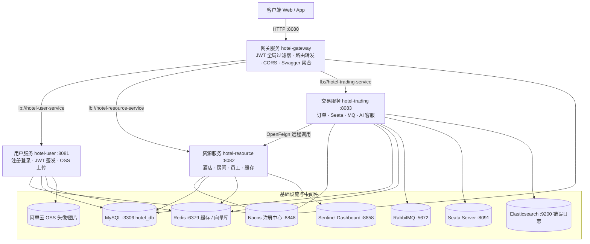
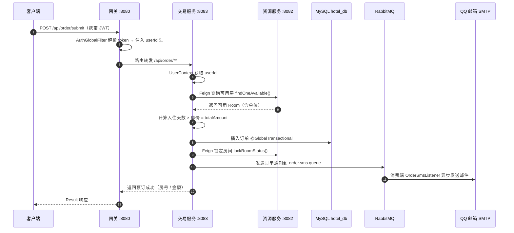
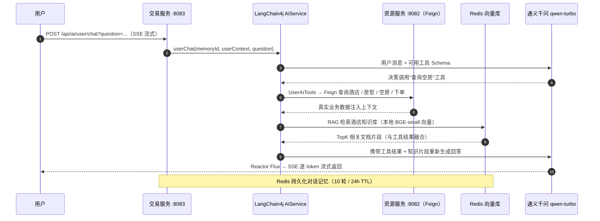

# CloudHotel 酒店管理系统（微服务版）

基于 **Spring Cloud Alibaba** 微服务架构的一站式酒店管理平台，覆盖用户注册登录、酒店/房间浏览、在线下单预订、订单管理，以及基于 **LangChain4j + 通义千问** 的 AI 智能客服（Function Calling + RAG + 流式输出）。集成 Nacos 注册发现、Gateway 统一网关、Sentinel 限流熔断、Seata 分布式事务、RabbitMQ 异步通知、Redis 缓存与向量检索等主流中间件，是一套完整的 `Spring Cloud 全家桶 + AI 大模型` 微服务实战项目。

> 仓库：https://github.com/Chillwinner/CloudHotel

---

## 目录

1. [项目简介](#一项目简介)
2. [快速部署](#二快速部署)
3. [系统详细介绍](#三系统详细介绍与架构图)
4. [项目优化与八股文沉淀](#四项目性能优化与八股文沉淀)

---

## 一、项目简介

### 1.1 技术亮点一览

| 亮点 | 技术方案 |
|------|----------|
| 微服务架构 | Spring Cloud Alibaba 全栈：Nacos + Gateway + Feign + LoadBalancer + Sentinel + Seata |
| 高性能缓存 | Redis 逻辑过期 + 随机偏移 + Redisson 读写锁，解决缓存穿透 / 击穿 / 雪崩 |
| 分布式事务 | Seata AT 模式（`@GlobalTransactional`），保证下单跨服务一致性 |
| 异步通知 | RabbitMQ 解耦下单链路，消费端异步发送 QQ 邮箱通知 |
| AI 客服 | LangChain4j + 通义千问：Function Calling 工具调用、BGE 本地向量 RAG、SSE 流式输出、Redis 对话记忆 |
| 可观测性 | AOP 切面采集接口错误日志，异步批量写入 Elasticsearch |

### 1.2 核心功能

| 模块 | 功能 |
|------|------|
| **用户服务** | 用户注册、登录（JWT）、阿里云 OSS 头像上传、用户信息管理 |
| **资源服务** | 酒店 / 房间 / 员工管理、空房查询、房间状态锁定与释放、Redis 缓存 + Redisson 锁 |
| **交易服务** | 下单（Seata 分布式事务）、订单查询与统计、RabbitMQ 邮件通知、AI 智能客服（工具调用 + RAG + 流式） |
| **网关服务** | 统一入口、`lb://` 动态路由、JWT 全局过滤器、跨域 CORS、Swagger 服务聚合 |

### 1.3 服务模块总览

| 服务 | 端口 | 注册名 | 职责 |
|------|------|--------|------|
| hotel_gateway | 8080 | hotel-gateway | 统一入口：路由转发、JWT 鉴权、CORS、Swagger 聚合 |
| hotel_user | 8081 | hotel-user-service | 用户注册登录、OSS 上传、用户缓存 |
| hotel-resource | 8082 | hotel-resource-service | 酒店 / 房间 / 员工业务，供交易服务远程调用 |
| hotel-trading | 8083 | hotel-trading-service | 订单、Seata 事务、RabbitMQ 通知、AI 客服 |

> 根目录 `src/` 为早期单体版本（`com.aura.hotel`），微服务版为 `hotel_*` 四个模块。

---

## 二、快速部署

### 2.1 环境要求

| 组件 | 说明 | 是否必需 |
|------|------|----------|
| JDK 21+ | Java LTS 版本 | 必需 |
| Maven 3.8+ | 多模块构建 | 必需 |
| MySQL 8.x | 业务数据库 `hotel_db`（端口 3306） | 必需 |
| Redis 6+ | 缓存 + 向量库（端口 6379） | 必需 |
| Nacos 2.2+ | 服务注册中心（端口 8848） | 必需 |
| RabbitMQ | 交易服务订单通知（端口 5672） | 交易服务必需 |
| Seata Server | 分布式事务协调器（端口 8091） | 下单事务必需 |
| Elasticsearch 7.x | 接口错误日志（`es.url`，默认关/可选） | 可选 |
| Sentinel Dashboard | 流控监控面板（端口 8858） | 可选 |
| 通义千问 API Key | AI 客服对话模型 | AI 功能必需 |

### 2.2 克隆项目

```bash
git clone https://github.com/Chillwinner/CloudHotel.git
cd CloudHotel
```

### 2.3 启动基础设施

```bash
# 1. 启动 Nacos（单机模式），控制台 http://localhost:8848/nacos
sh startup.sh -m standalone

# 2. 启动 Redis
redis-server

# 3. 启动 RabbitMQ（交易服务异步通知需要）
rabbitmq-server

# 4. 启动 Seata Server（下单分布式事务需要）
sh seata-server.sh   # 基于 nacos/file 配置注册

# 5.（可选）启动 Elasticsearch
# 6.（可选）启动 Sentinel Dashboard
java -Dserver.port=8858 -Dcsp.sentinel.dashboard.server=localhost:8858 \
     -jar sentinel-dashboard-1.8.6.jar
```

### 2.4 配置环境变量（复制配置文件并填写）

每个服务的 `application.yml` 均含有真实密钥（已被 `.gitignore` 忽略，请勿提交），部署时先复制其 `.example` 模板再填空：

```bash
cp hotel_user/src/main/resources/application.yml.example      hotel_user/src/main/resources/application.yml
cp hotel-resource/src/main/resources/application.yml.example hotel-resource/src/main/resources/application.yml
cp hotel-trading/src/main/resources/application.yml.example  hotel-trading/src/main/resources/application.yml
cp hotel_gateway/src/main/resources/application.yml.example  hotel_gateway/src/main/resources/application.yml
```

需要填写的配置项：

| 配置项 | 说明 |
|--------|------|
| `spring.datasource.password` | MySQL 密码 |
| `spring.data.redis.password` | Redis 密码 |
| `jwt.secret-key` | JWT 加密密钥（**四个服务必须保持相同**） |
| `sky.alioss.access-key-id / access-key-secret / bucket-name` | 阿里云 OSS 凭据（用户 / 资源服务） |
| `ai.qwen.api-key` | 通义千问 API Key（交易服务） |
| `spring.mail.username / password` | QQ 邮箱 + SMTP 授权码（交易服务） |
| `spring.rabbitmq.password` | RabbitMQ 密码（交易服务） |

### 2.5 初始化数据库

创建数据库（各服务内置 `DataSource` 指向 `hotel_db`）：

```sql
CREATE DATABASE hotel_db DEFAULT CHARACTER SET utf8mb4 COLLATE utf8mb4_unicode_ci;
```

> 说明：本仓库未附业务表 DDL 脚本，请根据 `com.Aura.entity` 下的实体（User / Hotel / Room / Staff / HotelOrder）自行建表；`sql/pgvector_schema.sql` 为可选的向量检索表脚本（本版 RAG 使用 Redis 向量库，该脚本仅供 PostgreSQL 方案参考）。

### 2.6 编译与启动

按依赖顺序依次启动（必须保证 Nacos、MySQL、Redis 已就绪）：

```bash
# 1. 全量编译（跳过测试）
mvn clean install -DskipTests

# 2. 按顺序启动各服务
cd hotel_user       && mvn spring-boot:run   # 8081
cd hotel-resource   && mvn spring-boot:run   # 8082
cd hotel-trading    && mvn spring-boot:run   # 8083
cd hotel_gateway    && mvn spring-boot:run   # 8080（最后启动）
```

### 2.7 验证部署

```bash
http://localhost:8080/swagger-ui.html    # 网关聚合三个服务的接口文档
http://localhost:8848/nacos              # 注册中心应能看到 4 个服务实例
http://localhost:8858                    # （可选）Sentinel 控制台
```

启动交易服务时，`AiConfig` 会加载 `rag-docs/` 目录下的酒店知识库文档并写入 Redis 向量库，首次观察日志确认成功即可开始 AI 问答。

---

## 三、系统详细介绍与架构图

### 3.1 系统总体架构



### 3.2 分层说明

所有微服务遵循统一代码规范：`Controller`（接口层）→ `Service`（业务层）→ `Mapper`（数据层，XML 位于 `resources/Mapper/`），公共返回体 `common/Result<T>` 与 `common/PageResult<T>`，实体使用 Lombok `@Data` 简化，用户上下文通过网关传递 + `utils/UserContext`（ThreadLocal）获取。

### 3.3 下单业务链路（分布式事务 + 异步通知）



该链路用 `@GlobalTransactional` 包裹整个跨服务写入（本地建单 + 远程锁房），任一步失败都会通过 **undo_log 自动回滚**；邮件通知走 MQ 异步解耦，不阻塞主流程。

### 3.4 AI 智能客服（Function Calling + RAG + 流式）



**AI 模块实现要点：**

| 子能力 | 实现 |
|--------|------|
| 对话模型 | 通义千问 `qwen-turbo`，OpenAI 兼容模式接入 DashScope |
| Function Calling | `UserAiTools` 注册 7 个工具：搜酒店 / 查详情 / 查房型 / 查空房 / 下单 / 查订单 / 查订单详情 |
| RAG 检索 | BGE-small-en 本地量化向量模型 + Redis 向量库（`langchain4j-community-redis`），`rag-docs/` 启动时分块入库，检索 TopK=3 |
| 流式输出 | Reactor `Flux<String>` + `StreamingResponseBody` 以 SSE 逐 token 下发 |
| 对话记忆 | `RedisChatMemoryStore` 持久化多轮记忆，按 userId 隔离，24h TTL |
| 管理员分析 | 注入订单统计（营收 / 完成 / 取消）与酒店分布数据，供管理层问询 |

---

## 四、项目性能优化与八股文沉淀

### 4.1 Redis 缓存三兄弟（`utils/CacheService`）

针对缓存经典问题的工程化解法，全部有落地代码：

| 问题 | 方案 | 代码对应 |
|------|------|----------|
| **缓存穿透** | 查询结果为空时写入 `"NULL"` 占位符（带 TTL），避免恶意 key 打穿 DB | `set()` 中 `data == null` 分支 |
| **缓存击穿** | 热点 key 逻辑过期 + Redisson **读写锁**互斥，仅单线程回源刷新 | `needRefresh()` + `getLock()` 写锁 |
| **缓存雪崩** | 物理 TTL 之上再叠加 **1~30 分钟随机偏移**，避免批量 key 同时失效 | `random.nextInt(30) * 60 * 1000` |
| **缓存一致性** | 先更 DB 后删缓存（`del` / `delPattern` 通配清理） | `del()` / `delPattern()` |
| **分布式锁** | Redisson `ReadWriteLock`：读锁共享、写锁互斥，看门狗自动续期、可重入 | `getLock()` |

> 面试答题公式：**穿透 → 空值缓存 / 布隆过滤器；击穿 → 互斥锁 / 逻辑过期异步刷新；雪崩 → 随机过期 / 多级缓存**，本项目三种问题在同一套 `CacheService` 中均有对应实现。

### 4.2 分布式事务（Seata AT 模式）

- `@GlobalTransactional` 开启全局事务，本地 SQL 通过 **undo_log** 记录回滚日志，二阶段提交保障「建单 + 锁房」跨服务原子性
- 全局锁避免并发事务对同一房间数据的脏写
- CAP 权衡：AT 模式牺牲部分强一致，换取业务侵入小 + 最终一致

### 4.3 消息队列（RabbitMQ）

- **异步解耦**：下单链路发消息即返回，`OrderSmsListener` 消费后发送邮件，主流程不等待
- **可靠性**：`@RabbitListener` 自动声明队列 `order.sms.queue` 并监听
- 可扩展：生产者确认、手动 ACK、死信队列、幂等（去重表 / Redis SETNX）的落地思路

### 4.4 微服务治理

| 组件 | 应用点 | 八股要点 |
|------|--------|----------|
| **Nacos** | 四服务注册发现 | 临时实例心跳、AP/CP 模式、容量保护 |
| **Gateway** | 统一网关、`lb://` 路由、Swagger 聚合 | 路由谓词、`GlobalFilter` 过滤器链、CORS |
| **Sentinel** | 资源服务网关依赖、Dashboard 实时监控 | 滑动窗口限流、熔断降级、热点参数 |
| **OpenFeign** | 交易 → 资源远程调用 | 声明式 API、LoadBalancer 集成、服务降级 |
| **JWT** | 网关全局鉴权 + ThreadLocal 上下文 | 无状态认证、Header.Payload.Signature、过期刷新 |

### 4.5 AI Agent 落地（求职加分项）

- **Function Calling**：LLM 自主决策调用业务工具，联动真实库存与订单，杜绝"AI 乱编"
- **RAG 检索增强**：文档分块 → BGE 向量化 → Redis 向量召回 → 上下文注入，从源头减少幻觉
- **流式交互**：SSE 逐 token 输出，提升对话体感
- **持久化记忆**：Redis 保存多轮对话，支持按用户隔离与冷启动恢复

### 4.6 AOP 日志与可观测性

- `EsLogAspect` 环绕通知拦截 Controller，采集**错误请求**的方法、参数、耗时与时间戳
- 有界内存队列（500）缓冲 + 守护线程每 5s **批量 `_bulk`** 写入 ES，失败自动回队重试，避免阻塞业务线程、降低日志 IO 压力

### 4.7 安全性

- 密码 MD5 加密（`spring-security-crypto`），JWT 无状态鉴权
- 密钥仅存本地 `application.yml`（已被 `.gitignore` 忽略），只提交占位模板 `application.yml.example`，防止真实凭据入库

---

## License

[MIT](LICENSE)