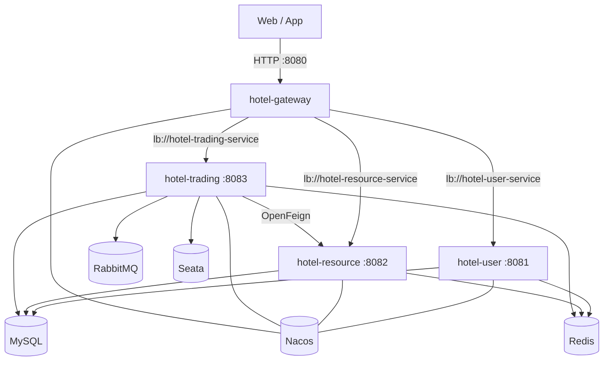

<div align="center">
  
  <h1>CloudHotel</h1>
  <p><strong>Hotel management on Spring Cloud Alibaba + an AI concierge</strong></p>
  <p>Four services: accounts, hotels/rooms, booking, and orders — plus LangChain4j + Qwen (function calling, RAG, streaming).</p>
  <p>
    <a href="./README.md">简体中文</a> ·
    <a href="./README_en.md">English</a>
  </p>
  <p>
    <a href="https://github.com/Chillwinner/CloudHotel/stargazers"></a>
    
    
    
  </p>
</div>

A full Spring Cloud Alibaba hotel stack: Nacos, Gateway, Sentinel, Seata, RabbitMQ, Redis, plus an AI desk (function calling + local BGE RAG + SSE). The longer Chinese README has interview notes and sequence diagrams.

## Features

| Area | What it does |
| --- | --- |
| **User** | Register / JWT login, OSS avatars, profile |
| **Resource** | Hotels, rooms, staff, vacancy, Redis + Redisson locks |
| **Trading** | Book with Seata AT, order stats, email via RabbitMQ, AI chat |
| **Gateway** | Single entry, `lb://` routes, JWT filter, CORS, aggregated Swagger |

| Service | Port | Registry name |
| --- | --- | --- |
| `hotel_gateway` | 8080 | hotel-gateway |
| `hotel_user` | 8081 | hotel-user-service |
| `hotel-resource` | 8082 | hotel-resource-service |
| `hotel-trading` | 8083 | hotel-trading-service |

`src/` is an older monolith. The microservices live in the `hotel_*` modules.

## Architecture



## Quick start

Need JDK 21, Maven 3.8+, MySQL 8, Redis, Nacos. Trading also needs RabbitMQ, Seata, and a Qwen API key.

```bash
git clone https://github.com/Chillwinner/CloudHotel.git
cd CloudHotel

cp hotel_user/src/main/resources/application.yml.example      hotel_user/src/main/resources/application.yml
cp hotel-resource/src/main/resources/application.yml.example hotel-resource/src/main/resources/application.yml
cp hotel-trading/src/main/resources/application.yml.example  hotel-trading/src/main/resources/application.yml
cp hotel_gateway/src/main/resources/application.yml.example  hotel_gateway/src/main/resources/application.yml
```

Fill MySQL / Redis / JWT (`jwt.secret-key` must match on all four), OSS, Qwen, mail, and RabbitMQ. Then:

```sql
CREATE DATABASE hotel_db DEFAULT CHARACTER SET utf8mb4 COLLATE utf8mb4_unicode_ci;
```

```bash
# Nacos standalone, Redis, RabbitMQ, Seata first
mvn clean install -DskipTests
cd hotel_user     && mvn spring-boot:run   # 8081
cd hotel-resource && mvn spring-boot:run   # 8082
cd hotel-trading  && mvn spring-boot:run   # 8083
cd hotel_gateway  && mvn spring-boot:run   # 8080 last
```

- Swagger: [http://localhost:8080/swagger-ui.html](http://localhost:8080/swagger-ui.html)
- Nacos: [http://localhost:8848/nacos](http://localhost:8848/nacos)

The repo does not ship business DDL. Create tables from the entities (`User` / `Hotel` / `Room` / `Staff` / `HotelOrder`). Do not commit real `application.yml` files.

## License

MIT — see the Chinese README for cache, Seata, and AI details.
